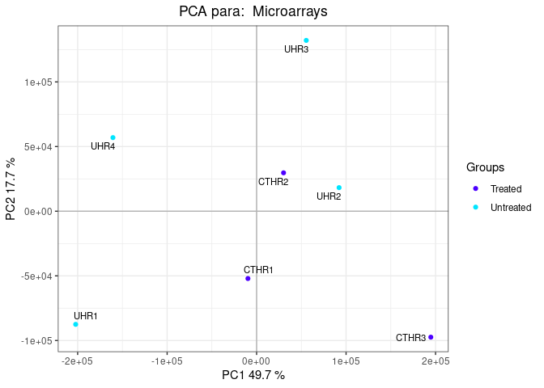
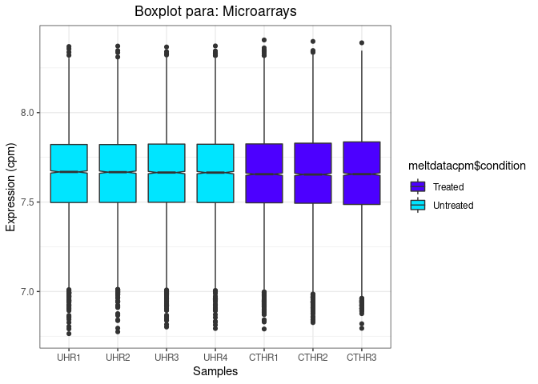
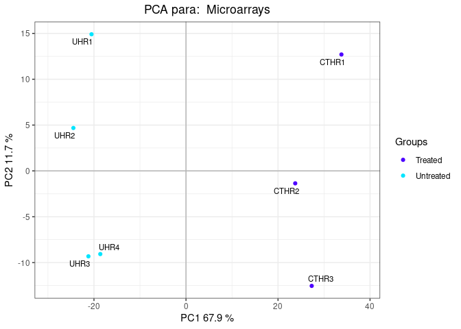
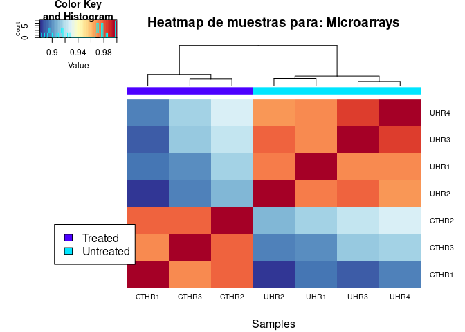

<!-- README.md is generated from README.Rmd. Please edit that file -->

# TFMjrufv

<!-- badges: start -->
<!-- badges: end -->

Este paquete pretende crear un *pipeline* que permita realizar un
análisis estadístico completo de diferentes tipos de datos ómicos.

## Instalación

Puede instalar la versión en desarrollo desde
[GitHub](https://github.com) con:

``` r
install.packages("devtools")
#> Installing package into '/tmp/RtmpuK2pJA/temp_libpathbb25e2329c1'
#> (as 'lib' is unspecified)
library(devtools)
#> Loading required package: usethis
devtools::install_github("jrufv/TFMjrufv", upgrade = "always")
#> Downloading GitHub repo jrufv/TFMjrufv@HEAD
#> 
#>      checking for file ‘/tmp/RtmpRmZGiT/remotesd8547f6840d/jrufv-TFMjrufv-143ca40/DESCRIPTION’ ...  ✓  checking for file ‘/tmp/RtmpRmZGiT/remotesd8547f6840d/jrufv-TFMjrufv-143ca40/DESCRIPTION’
#>   ─  preparing ‘TFMjrufv’: (363ms)
#>   ✓  checking DESCRIPTION meta-information
#> ─  checking for LF line-endings in source and make files and shell scripts
#> ─  checking for empty or unneeded directories
#>      NB: this package now depends on R (>= 3.5.0)
#>      WARNING: Added dependency on R >= 3.5.0 because serialized objects in
#>      serialize/load version 3 cannot be read in older versions of R.
#>      File(s) containing such objects:
#>        ‘TFMjrufv/data/.RData’
#> ─  building ‘TFMjrufv_0.0.0.9000.tar.gz’
#>      
#> 
#> Installing package into '/tmp/RtmpuK2pJA/temp_libpathbb25e2329c1'
#> (as 'lib' is unspecified)
library(TFMjrufv)
```

## Ejemplo 1. Datos de microarray

### 1.1 Carga de paquetes de Bioconductor

En primer lugar usamos la función `ins_pack()` para instalar (en caso
necesario) y cargar los paquetes de Bioconductor necesarios. Además
podemos añadir el paquete de anotaciones que usaremos durante el
análisis.

``` r
library(TFMjrufv)
ins_pack(annot_pack = "hgu133a.db")
#> Loading required package: AnnotationDbi
#> Loading required package: stats4
#> Loading required package: BiocGenerics
#> Loading required package: parallel
#> 
#> Attaching package: 'BiocGenerics'
#> The following objects are masked from 'package:parallel':
#> 
#>     clusterApply, clusterApplyLB, clusterCall, clusterEvalQ,
#>     clusterExport, clusterMap, parApply, parCapply, parLapply,
#>     parLapplyLB, parRapply, parSapply, parSapplyLB
#> The following objects are masked from 'package:stats':
#> 
#>     IQR, mad, sd, var, xtabs
#> The following objects are masked from 'package:base':
#> 
#>     anyDuplicated, append, as.data.frame, basename, cbind, colnames,
#>     dirname, do.call, duplicated, eval, evalq, Filter, Find, get, grep,
#>     grepl, intersect, is.unsorted, lapply, Map, mapply, match, mget,
#>     order, paste, pmax, pmax.int, pmin, pmin.int, Position, rank,
#>     rbind, Reduce, rownames, sapply, setdiff, sort, table, tapply,
#>     union, unique, unsplit, which.max, which.min
#> Loading required package: Biobase
#> Welcome to Bioconductor
#> 
#>     Vignettes contain introductory material; view with
#>     'browseVignettes()'. To cite Bioconductor, see
#>     'citation("Biobase")', and for packages 'citation("pkgname")'.
#> Loading required package: IRanges
#> Loading required package: S4Vectors
#> 
#> Attaching package: 'S4Vectors'
#> The following objects are masked from 'package:base':
#> 
#>     expand.grid, I, unname
#> Loading required package: edgeR
#> Loading required package: limma
#> 
#> Attaching package: 'limma'
#> The following object is masked from 'package:BiocGenerics':
#> 
#>     plotMA
#> Loading required package: enrichplot
#> 
#> Loading required package: genefilter
#> Loading required package: MSnbase
#> Loading required package: mzR
#> Loading required package: Rcpp
#> Loading required package: ProtGenerics
#> 
#> Attaching package: 'ProtGenerics'
#> The following object is masked from 'package:stats':
#> 
#>     smooth
#> 
#> This is MSnbase version 2.17.7 
#>   Visit https://lgatto.github.io/MSnbase/ to get started.
#> 
#> Attaching package: 'MSnbase'
#> The following object is masked from 'package:base':
#> 
#>     trimws
#> Loading required package: oligo
#> Loading required package: oligoClasses
#> Welcome to oligoClasses version 1.53.0
#> 
#> Attaching package: 'oligoClasses'
#> The following object is masked from 'package:mzR':
#> 
#>     manufacturer
#> Loading required package: Biostrings
#> Loading required package: XVector
#> Loading required package: GenomeInfoDb
#> 
#> Attaching package: 'Biostrings'
#> The following object is masked from 'package:base':
#> 
#>     strsplit
#> ================================================================================
#> Welcome to oligo version 1.55.1
#> ================================================================================
#> 
#> Attaching package: 'oligo'
#> The following objects are masked from 'package:MSnbase':
#> 
#>     intensity, MAplot
#> The following object is masked from 'package:ProtGenerics':
#> 
#>     intensity
#> The following object is masked from 'package:limma':
#> 
#>     backgroundCorrect
#> Loading required package: pmp
#> Loading required package: POMA
#> Welcome to POMA!
#> ✔ 1.1.15 version
#> ✔ POMAShiny app: https://github.com/pcastellanoescuder/POMAShiny
#> ℹ For more detailed package information please visit https://pcastellanoescuder.github.io/POMA/
#> Loading required package: ReactomePA
#> ReactomePA v1.35.1  For help: https://yulab-smu.top/biomedical-knowledge-mining-book/reactomepa.html
#> 
#> If you use ReactomePA in published research, please cite:
#> Guangchuang Yu, Qing-Yu He. ReactomePA: an R/Bioconductor package for reactome pathway analysis and visualization. Molecular BioSystems 2016, 12(2):477-479
#> Loading required package: SummarizedExperiment
#> Loading required package: MatrixGenerics
#> Loading required package: matrixStats
#> 
#> Attaching package: 'matrixStats'
#> The following objects are masked from 'package:genefilter':
#> 
#>     rowSds, rowVars
#> The following objects are masked from 'package:Biobase':
#> 
#>     anyMissing, rowMedians
#> 
#> Attaching package: 'MatrixGenerics'
#> The following objects are masked from 'package:matrixStats':
#> 
#>     colAlls, colAnyNAs, colAnys, colAvgsPerRowSet, colCollapse,
#>     colCounts, colCummaxs, colCummins, colCumprods, colCumsums,
#>     colDiffs, colIQRDiffs, colIQRs, colLogSumExps, colMadDiffs,
#>     colMads, colMaxs, colMeans2, colMedians, colMins, colOrderStats,
#>     colProds, colQuantiles, colRanges, colRanks, colSdDiffs, colSds,
#>     colSums2, colTabulates, colVarDiffs, colVars, colWeightedMads,
#>     colWeightedMeans, colWeightedMedians, colWeightedSds,
#>     colWeightedVars, rowAlls, rowAnyNAs, rowAnys, rowAvgsPerColSet,
#>     rowCollapse, rowCounts, rowCummaxs, rowCummins, rowCumprods,
#>     rowCumsums, rowDiffs, rowIQRDiffs, rowIQRs, rowLogSumExps,
#>     rowMadDiffs, rowMads, rowMaxs, rowMeans2, rowMedians, rowMins,
#>     rowOrderStats, rowProds, rowQuantiles, rowRanges, rowRanks,
#>     rowSdDiffs, rowSds, rowSums2, rowTabulates, rowVarDiffs, rowVars,
#>     rowWeightedMads, rowWeightedMeans, rowWeightedMedians,
#>     rowWeightedSds, rowWeightedVars
#> The following objects are masked from 'package:genefilter':
#> 
#>     rowSds, rowVars
#> The following object is masked from 'package:Biobase':
#> 
#>     rowMedians
#> Loading required package: GenomicRanges
#> Loading required package: xcms
#> Loading required package: BiocParallel
#> 
#> This is xcms version 3.13.8
#> 
#> Attaching package: 'xcms'
#> The following object is masked from 'package:SummarizedExperiment':
#> 
#>     distance
#> The following object is masked from 'package:GenomicRanges':
#> 
#>     distance
#> The following object is masked from 'package:IRanges':
#> 
#>     distance
#> The following object is masked from 'package:stats':
#> 
#>     sigma
#> Loading required package: hgu133a.db
#> Loading required package: org.Hs.eg.db
#> 
#> 
```

### 1.2 Lectura de datos

Los datos los tenemos almacenados en archivos .CEL (uno por muestra).
Además debemos crear un archivo de texto en el que indicaremos las
características de cada muestra para poder realizar el análisis.

Nota: Se recomienda cambiar el directorio de trabajo a la carpeta del
paquete. De lo contrario deberá modificar los parámetros `path` y
`targets` para especificar la ruta de archivo específica.

``` r
data_microarray <- read_data(data_type = "microarray",
                             path = "./inst/extdata/microarray",
                             targets = "./inst/extdata/microarray/targets.csv",
                             sep_targ = ";",
                             gz_file = FALSE)
#> Loading required package: pd.hg.u133a
#> Loading required package: RSQLite
#> Loading required package: DBI
#> Platform design info loaded.
#> Reading in : ./inst/extdata/microarray/GSM23372.CEL
#> Reading in : ./inst/extdata/microarray/GSM23373.CEL
#> Reading in : ./inst/extdata/microarray/GSM23377.CEL
#> Reading in : ./inst/extdata/microarray/GSM23378.CEL
#> Reading in : ./inst/extdata/microarray/GSM23382.CEL
#> Reading in : ./inst/extdata/microarray/GSM23383.CEL
#> Reading in : ./inst/extdata/microarray/GSM23384.CEL
#> Warning in oligo::read.celfiles(files, phenoData = sampleinfo): 'channel'
#> automatically added to varMetadata in phenoData.
head(exprs(data_microarray))
#>     UHR1    UHR2    UHR3    UHR4   CTHR1   CTHR2  CTHR3
#> 1   89.3   137.3   133.8    76.3   121.5   101.3  100.0
#> 2 6860.3 11210.5 14479.3  9876.5 10133.3 11418.8 9968.5
#> 3   97.8   178.8   124.8   100.0   144.3   114.0  112.5
#> 4 6809.0 10973.3 14421.0 10595.8 10417.5 11588.3 9872.0
#> 5   54.3    89.8    68.3    60.5    68.3    56.5   52.3
#> 6   93.0   130.5   114.8    83.5   129.5   120.3  109.3
pData(data_microarray)
#>       ShortName     Group
#> UHR1       UHR1 Untreated
#> UHR2       UHR2 Untreated
#> UHR3       UHR3 Untreated
#> UHR4       UHR4 Untreated
#> CTHR1     CTHR1   Treated
#> CTHR2     CTHR2   Treated
#> CTHR3     CTHR3   Treated
```

### 1.3 Visualización de los dato brutos

La función `plotTFM()` permite visualizar diferentes gráficos.

``` r
plotTFM(data_microarray, plot = "boxplot")
#> Warning in type.convert.default(X[[i]], ...): 'as.is' should be specified by the
#> caller; using TRUE

#> Warning in type.convert.default(X[[i]], ...): 'as.is' should be specified by the
#> caller; using TRUE

#> Warning in type.convert.default(X[[i]], ...): 'as.is' should be specified by the
#> caller; using TRUE

#> Warning in type.convert.default(X[[i]], ...): 'as.is' should be specified by the
#> caller; using TRUE
#> Warning: Use of `meltdatacpm$samples` is discouraged. Use `samples` instead.
#> Warning: Use of `meltdatacpm$condition` is discouraged. Use `condition` instead.
```


``` r
plotTFM(data_microarray, plot = "density")
#> Warning in type.convert.default(X[[i]], ...): 'as.is' should be specified by the
#> caller; using TRUE
#> Warning in type.convert.default(X[[i]], ...): 'as.is' should be specified by the
#> caller; using TRUE

#> Warning in type.convert.default(X[[i]], ...): 'as.is' should be specified by the
#> caller; using TRUE

#> Warning in type.convert.default(X[[i]], ...): 'as.is' should be specified by the
#> caller; using TRUE
#> Warning: Use of `meltdata$condition` is discouraged. Use `condition` instead.
```


``` r
plotTFM(data_microarray, plot = "PCA")
#> Warning in type.convert.default(X[[i]], ...): 'as.is' should be specified by the
#> caller; using TRUE
#> Warning in type.convert.default(X[[i]], ...): 'as.is' should be specified by the
#> caller; using TRUE

#> Warning in type.convert.default(X[[i]], ...): 'as.is' should be specified by the
#> caller; using TRUE

#> Warning in type.convert.default(X[[i]], ...): 'as.is' should be specified by the
#> caller; using TRUE
#> Warning: Use of `pcdata$PC1` is discouraged. Use `PC1` instead.
#> Warning: Use of `pcdata$PC2` is discouraged. Use `PC2` instead.
#> Warning: Use of `pcdata$PC1` is discouraged. Use `PC1` instead.
#> Warning: Use of `pcdata$PC2` is discouraged. Use `PC2` instead.
```



``` r
plotTFM(data_microarray, plot = "heatmap")
#> Warning in type.convert.default(X[[i]], ...): 'as.is' should be specified by the
#> caller; using TRUE
#> Warning in type.convert.default(X[[i]], ...): 'as.is' should be specified by the
#> caller; using TRUE

#> Warning in type.convert.default(X[[i]], ...): 'as.is' should be specified by the
#> caller; using TRUE

#> Warning in type.convert.default(X[[i]], ...): 'as.is' should be specified by the
#> caller; using TRUE
```


``` r
plotTFM(data_microarray, plot = "heatmapS")
#> Warning in type.convert.default(X[[i]], ...): 'as.is' should be specified by the
#> caller; using TRUE

#> Warning in type.convert.default(X[[i]], ...): 'as.is' should be specified by the
#> caller; using TRUE

#> Warning in type.convert.default(X[[i]], ...): 'as.is' should be specified by the
#> caller; using TRUE

#> Warning in type.convert.default(X[[i]], ...): 'as.is' should be specified by the
#> caller; using TRUE
```


### 1.4 Preprocesamiento y normalizacion

La función `prep_norm_microarray()` permite realizar el filtraje no
específico de los datos mediante los argumentos `varFilter` y
`featureFilter`, y posteriormente realiza la normalización de los datos.

``` r
norm_data_microarray <- prep_norm_microarray(data_microarray,
                                             varFilter = TRUE,
                                             featureFilter = TRUE,
                                             annot_pack = "hgu133a.db")
#> Background correcting
#> Normalizing
#> Calculating Expression
head(exprs(norm_data_microarray))
#>                  UHR1      UHR2      UHR3      UHR4    CTHR1     CTHR2
#> 203440_at   10.075796 10.477572 10.744096 10.614318 9.721993 10.366111
#> 207079_s_at  8.019684  7.581823  7.817177  7.755407 6.335449  7.375170
#> 209027_s_at  7.766735  7.840724  7.403147  7.144601 5.975719  6.529452
#> 202382_s_at  8.149254  7.915265  8.315253  8.248825 8.453436  8.637004
#> 209451_at    4.877752  5.655935  4.877752  4.530698 4.707170  4.885731
#> 217087_at    6.902545  7.097501  6.843267  7.214645 7.280983  7.431862
#>                 CTHR3
#> 203440_at   10.264942
#> 207079_s_at  7.118590
#> 209027_s_at  6.452251
#> 202382_s_at  8.962548
#> 209451_at    5.290542
#> 217087_at    7.099811
```

### 1.5 Visualización de los datos normalizados

Una vez se han normalizado los datos se pueden comparar los gráficos
antes y después de la normalización.

``` r
plotTFM(norm_data_microarray, plot = "boxplot")
#> Warning in type.convert.default(X[[i]], ...): 'as.is' should be specified by the
#> caller; using TRUE

#> Warning in type.convert.default(X[[i]], ...): 'as.is' should be specified by the
#> caller; using TRUE

#> Warning in type.convert.default(X[[i]], ...): 'as.is' should be specified by the
#> caller; using TRUE

#> Warning in type.convert.default(X[[i]], ...): 'as.is' should be specified by the
#> caller; using TRUE
#> Warning: Use of `meltdatacpm$samples` is discouraged. Use `samples` instead.
#> Warning: Use of `meltdatacpm$condition` is discouraged. Use `condition` instead.
```



``` r
plotTFM(norm_data_microarray, plot = "density")
#> Warning in type.convert.default(X[[i]], ...): 'as.is' should be specified by the
#> caller; using TRUE
#> Warning in type.convert.default(X[[i]], ...): 'as.is' should be specified by the
#> caller; using TRUE

#> Warning in type.convert.default(X[[i]], ...): 'as.is' should be specified by the
#> caller; using TRUE

#> Warning in type.convert.default(X[[i]], ...): 'as.is' should be specified by the
#> caller; using TRUE
#> Warning: Use of `meltdata$condition` is discouraged. Use `condition` instead.
```


``` r
plotTFM(norm_data_microarray, plot = "PCA")
#> Warning in type.convert.default(X[[i]], ...): 'as.is' should be specified by the
#> caller; using TRUE
#> Warning in type.convert.default(X[[i]], ...): 'as.is' should be specified by the
#> caller; using TRUE

#> Warning in type.convert.default(X[[i]], ...): 'as.is' should be specified by the
#> caller; using TRUE

#> Warning in type.convert.default(X[[i]], ...): 'as.is' should be specified by the
#> caller; using TRUE
#> Warning: Use of `pcdata$PC1` is discouraged. Use `PC1` instead.
#> Warning: Use of `pcdata$PC2` is discouraged. Use `PC2` instead.
#> Warning: Use of `pcdata$PC1` is discouraged. Use `PC1` instead.
#> Warning: Use of `pcdata$PC2` is discouraged. Use `PC2` instead.
```



``` r
plotTFM(norm_data_microarray, plot = "heatmap")
#> Warning in type.convert.default(X[[i]], ...): 'as.is' should be specified by the
#> caller; using TRUE
#> Warning in type.convert.default(X[[i]], ...): 'as.is' should be specified by the
#> caller; using TRUE

#> Warning in type.convert.default(X[[i]], ...): 'as.is' should be specified by the
#> caller; using TRUE

#> Warning in type.convert.default(X[[i]], ...): 'as.is' should be specified by the
#> caller; using TRUE
```


``` r
plotTFM(norm_data_microarray, plot = "heatmapS")
#> Warning in type.convert.default(X[[i]], ...): 'as.is' should be specified by the
#> caller; using TRUE

#> Warning in type.convert.default(X[[i]], ...): 'as.is' should be specified by the
#> caller; using TRUE

#> Warning in type.convert.default(X[[i]], ...): 'as.is' should be specified by the
#> caller; using TRUE

#> Warning in type.convert.default(X[[i]], ...): 'as.is' should be specified by the
#> caller; using TRUE
```



### 1.6 Análisis de expresión diferencial

La función `dea()` realiza un análisis de expresión diferencial basado
en modelos lineales del paquete limma. El retorno de la funcion consta
de una lista con un marco de datos para cada contraste realizado, una
tabla que muestra la cantidad de analitos sobreexpresados e
infraexpresados por contraste y un objeto TestResults que mantiene los
analitos que han mostrado expresión diferencial en algún contraste.

``` r
dea_microarray <- dea(norm_data_microarray, cont = "Treated-Untreated",
                      name = "TRvsUN", maxanal = 1000, adjmethod = "fdr",
                      pvalcoff = 0.1, dtmethod = "separate")
head(dea_microarray[[1]])
#>                 logFC  AveExpr         t      P.Value    adj.P.Val        B
#> 36711_at     4.208272 5.701037  23.78321 1.814076e-18 1.124546e-14 31.48386
#> 202672_s_at  2.914235 8.530236  17.11506 3.732774e-15 1.156973e-11 24.54060
#> 220952_s_at -3.109164 6.473018 -16.28228 1.154659e-14 2.385909e-11 23.47338
#> 212653_s_at -2.710004 6.764173 -15.44444 3.780226e-14 5.858405e-11 22.34393
#> 209409_at   -2.600283 8.302325 -14.71795 1.104226e-13 1.369019e-10 21.31613
#> 218611_at    2.576729 8.995985  14.58962 1.340343e-13 1.384798e-10 21.12967
dea_microarray[[2]]
#>        TRvsUN
#> Down     1887
#> NotSig   3229
#> Up       1083
dea_microarray[[3]]
#> TestResults matrix
#>              Contrasts
#>               TRvsUN
#>   207079_s_at     -1
#>   209027_s_at     -1
#>   202382_s_at      1
#>   221847_at        1
#>   217746_s_at     -1
#> 2965 more rows ...
```

### 1.7 Anotación de resultados

A continuacion se añaden las anotaciones de los genes seleccionados en
cada contraste (en nuestro caso un unico contraste).

``` r
anot_dea_microarray <- annotated(dea_microarray, maPackage = "hgu133a.db",
                                 ID = "PROBEID")
#> 'select()' returned 1:1 mapping between keys and columns
head(anot_dea_microarray[[1]])
#>       PROBEID ENTREZID  SYMBOL                                 GENENAME
#> 1    36711_at    23764    MAFF          MAF bZIP transcription factor F
#> 2 202672_s_at      467    ATF3        activating transcription factor 3
#> 3 220952_s_at    54477 PLEKHA5 pleckstrin homology domain containing A5
#> 4 212653_s_at    23301   EHBP1              EH domain binding protein 1
#> 5   209409_at     2887   GRB10  growth factor receptor bound protein 10
#> 6   218611_at    51278    IER5               immediate early response 5
#>       logFC  AveExpr         t      P.Value    adj.P.Val        B
#> 1  4.208272 5.701037  23.78321 1.814076e-18 1.124546e-14 31.48386
#> 2  2.914235 8.530236  17.11506 3.732774e-15 1.156973e-11 24.54060
#> 3 -3.109164 6.473018 -16.28228 1.154659e-14 2.385909e-11 23.47338
#> 4 -2.710004 6.764173 -15.44444 3.780226e-14 5.858405e-11 22.34393
#> 5 -2.600283 8.302325 -14.71795 1.104226e-13 1.369019e-10 21.31613
#> 6  2.576729 8.995985  14.58962 1.340343e-13 1.384798e-10 21.12967
```

### 1.8 Análisis de significación biológica

Finalmente podemos realizar el análisis de enriquecimiento para
encontrar las vías que se expresan diferencialmente en cada contraste.

``` r
enRes_microarray <- bsa(anot_dea_microarray, GOPackage = org.Hs.egGO,
                        PATHPackage = org.Hs.egPATH, organism = "human",
                        pvcoff = 0.05, padmethod = "BH")
enRes_microarray
#> $TRvsUN
#> #
#> # over-representation test
#> #
#> #...@organism     human 
#> #...@ontology     Reactome 
#> #...@keytype      ENTREZID 
#> #...@gene     chr [1:1000] "23764" "467" "54477" "23301" "2887" "51278" "10614" "116039" ...
#> #...pvalues adjusted by 'BH' with cutoff <0.05 
#> #...122 enriched terms found
#> 'data.frame':    122 obs. of  9 variables:
#>  $ ID         : chr  "R-HSA-2500257" "R-HSA-141424" "R-HSA-141444" "R-HSA-68877" ...
#>  $ Description: chr  "Resolution of Sister Chromatid Cohesion" "Amplification of signal from the kinetochores" "Amplification  of signal from unattached  kinetochores via a MAD2  inhibitory signal" "Mitotic Prometaphase" ...
#>  $ GeneRatio  : chr  "32/680" "26/680" "26/680" "39/680" ...
#>  $ BgRatio    : chr  "124/10818" "94/10818" "94/10818" "201/10818" ...
#>  $ pvalue     : num  3.22e-12 6.62e-11 6.62e-11 1.85e-10 3.24e-10 ...
#>  $ p.adjust   : num  4.01e-09 2.75e-08 2.75e-08 5.75e-08 8.07e-08 ...
#>  $ qvalue     : num  3.21e-09 2.20e-08 2.20e-08 4.60e-08 6.46e-08 ...
#>  $ geneID     : chr  "BUB1B/PDS5B/NDC80/STAG2/TUBB2A/MAD1L1/PPP2R5E/STAG1/PAFAH1B1/BUB1/PPP2R5C/CENPE/PDS5A/XPO1/SPC25/CENPI/CENPF/CL"| __truncated__ "BUB1B/NDC80/MAD1L1/PPP2R5E/PAFAH1B1/BUB1/PPP2R5C/CENPE/XPO1/SPC25/CENPI/CENPF/CLIP1/CLASP2/CKAP5/PLK1/KIF2A/KIF"| __truncated__ "BUB1B/NDC80/MAD1L1/PPP2R5E/PAFAH1B1/BUB1/PPP2R5C/CENPE/XPO1/SPC25/CENPI/CENPF/CLIP1/CLASP2/CKAP5/PLK1/KIF2A/KIF"| __truncated__ "BUB1B/PDS5B/NDC80/STAG2/TUBB2A/TUBGCP3/MAD1L1/AKAP9/PPP2R5E/STAG1/PAFAH1B1/BUB1/PPP2R5C/CENPE/PDS5A/XPO1/SPC25/"| __truncated__ ...
#>  $ Count      : int  32 26 26 39 28 27 51 17 40 40 ...
#> #...Citation
#>   Guangchuang Yu, Qing-Yu He. ReactomePA: an R/Bioconductor package for
#>   reactome pathway analysis and visualization. Molecular BioSystems
#>   2016, 12(2):477-479
```
